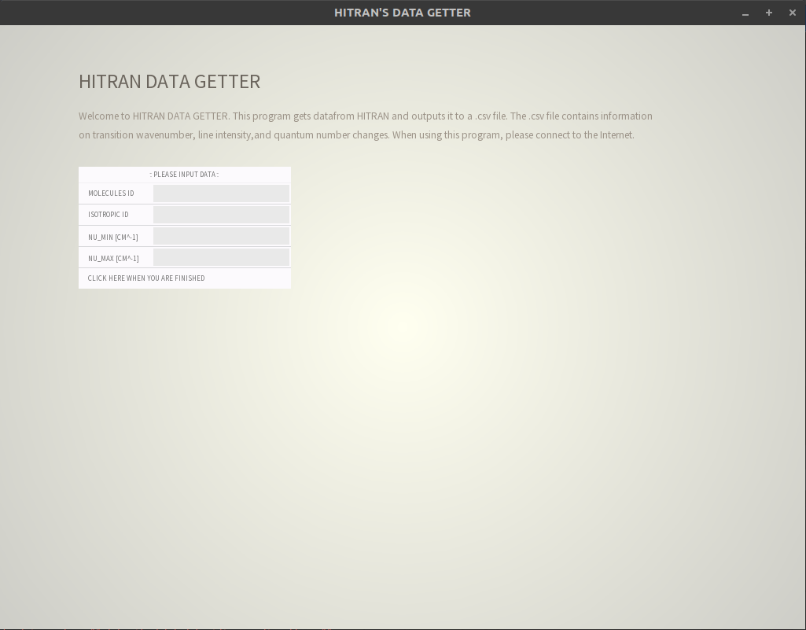

# About this program

### Expected Behavior

This is symple hitran data geter with openflameworks. This program gets data from HITRAN and outputs it to a .csv file. The .csv file contains information on transition wavenumber, line intensity, and quantum number changes.

